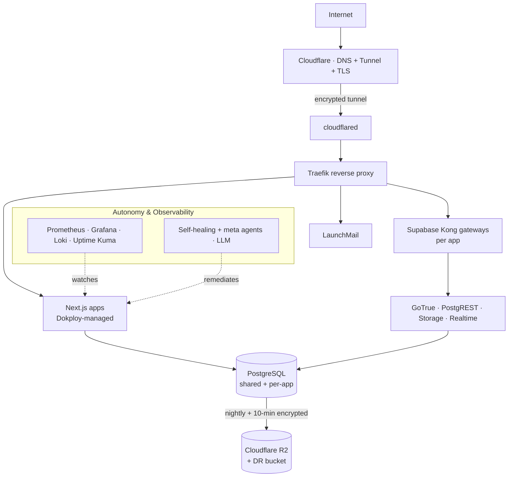

# 🏠 Homelab — self-hosted production infrastructure

> One mini-PC that replaced **Vercel + Supabase Cloud + Railway + Resend** — running real
> SaaS products in production, fully self-hosted, with autonomous self-healing, encrypted
> off-site backups, and zero monthly platform fees.

This repo is the reproducible blueprint for a home server that hosts several live products
behind a Cloudflare Tunnel with the operational maturity of a managed platform: one-command
deploys, per-app self-hosted Supabase, full observability, and a set of LLM-powered agents
that keep it running without manual babysitting.

---

## 🖥️ The machine

| | |
|---|---|
| **Hardware** | Lenovo ThinkCentre M920q · Intel Core i7-9700T (8 cores) · 32 GB RAM · 1 TB NVMe |
| **OS** | Ubuntu Server 24.04 LTS |
| **Runtime** | Docker (Swarm + Compose), ~40 containers |
| **Exposure** | **Zero open inbound ports** — everything via Cloudflare Tunnel |
| **Uptime** | 99.9% |

## 🌐 What runs on it (production)

- **[anikin.cz](https://anikin.cz)** — personal portfolio
- **[freio.cz](https://freio.cz)** — EdTech SaaS (self-hosted Supabase, Stripe, own SMTP)
- **[ripieno.xyz](https://www.ripieno.xyz)** — autonomous AI dev platform
- **[lokwave.cz](https://lokwave.cz)** + 6 NicheLocal verticals — B2B SaaS family (dental/auto/vet/bistro/salon/fit)
- **gorillatype.anikin.cz**, **classio.anikin.cz** — self-hosted Supabase apps
- **LaunchMail** — own email platform (self-hosted ESP)

## 🏗️ Architecture

## ⭐ Autonomy & resilience

The server is designed to **run itself** — detect problems, fix the safe ones, and shout
loudly (Telegram) about the rest. Everything below is live and version-controlled here.

| Capability | What it does |
|---|---|
| 🩹 **Self-healing agent** | Polls Uptime Kuma + Prometheus alerts + Loki log-spikes → an LLM (Claude Code, headless) diagnoses & safely remediates per iron-clad guardrails; **verify-and-escalate** (recurring incident → human) |
| 🧠 **Self-improvement meta-agent** | Weekly: reviews incidents, metrics, config drift → writes postmortems, applies safe preventive fixes, proposes the rest (already caught & fixed an 11h silent crashloop) |
| 📋 **Daily health review** | Morning LLM digest: disk, certs, backup freshness, DB connections → Telegram |
| 🧪 **Synthetic checks** | Every 10 min: real auth (apikey health), DB queries, page render — deeper than uptime |
| 💾 **Backups** | Nightly encrypted backup → R2 + DR; Postiz uses one writer-fenced physical cluster, globals + 4 logical DBs, Redis/config/uploads/seasonal state and 4 exact images. Ten-minute Postiz dumps are primary-only per-DB PIT aids, not a full-service RPO. |
| ✅ **Restore drills** | Weekly network-none restore; the complete authenticated Postiz graph is proven independently from primary and DR |
| 🛡️ **Security** | Trivy CVE scanning, fail2ban, unattended OS upgrades, secrets never in git |
| ⬆️ **Safe auto-updates** | Weekly image updates with health-gate + **rollback**; pinned prod images left untouched |
| ↩️ **Deploy watchdog** | Post-deploy health gate → `docker service rollback` if a fresh deploy fails |
| 🐕 **Watchdog-on-watchdog** | The self-healer heartbeats Uptime Kuma; if it freezes, Kuma alerts independently |

## 📂 Repository layout

| Path | Contents |
|---|---|
| `scripts/bootstrap.sh` | One-shot fresh-server setup (hardening, Docker, Dokploy, Tailscale, cloudflared) |
| `scripts/backup.sh` · `scripts/frequent-db-backup.sh` | Encrypted nightly → primary+DR R2; 10-min per-DB PIT dumps → primary only |
| `scripts/postiz-artifact-backup.sh` | Encrypted CAS Postiz uploads + four content-addressed Docker archives under attested R2 Bucket Locks |
| `scripts/trivy-scan.sh` · `scripts/auto-update.sh` | CVE scanning · health-gated auto-updates with rollback |
| `scripts/supabase-selfhost/` | Generalized per-app self-hosted Supabase provisioner |
| `scripts/systemd/` | All timers & services (backups, drills, agents, watchdogs) |
| `self-healing/` | Poller, responder, meta-agent, synthetic checks, deploy-watchdog + agent guardrails (`CLAUDE.md`) |
| `compose/` | Postgres, observability (Prometheus/Grafana/Loki/Kuma), SMTP, inngest |
| `launchmail/` | Self-hosted email platform (own ESP, direct-MX delivery) |
| `docs/` | Networking, backups & restore, resilience, migrations, secrets inventory |
| `RUNBOOK.md` | Step-by-step: from bare metal to first running project |

## 🧭 Design principles

- **Zero-trust ingress** — no open ports; Cloudflare Tunnel terminates TLS.
- **Secrets never in git** — `secrets/` gitignored; encrypted off-site; decryption key off-box.
- **Reproducible** — infra as code; a fresh box rebuilds from this repo + secrets bundle.
- **Fail loud, then self-heal** — every failure alerts; the safe ones auto-remediate.
- **Tested recovery** — backups are restore-drilled weekly.

## 📖 Where to start

1. **[RUNBOOK.md](RUNBOOK.md)** — bring a fresh box to production, step by step
2. **[docs/resilience.md](docs/resilience.md)** — the backup + self-healing architecture in depth
3. **[docs/networking.md](docs/networking.md)** — Cloudflare Tunnel, domains, Tailscale

---

Built and operated by <a href="https://anikin.cz">Danila Sergejevič Anikin</a>. Infrastructure as a
craft — a server you can rebuild from git and trust to heal itself is worth more than any managed platform.
